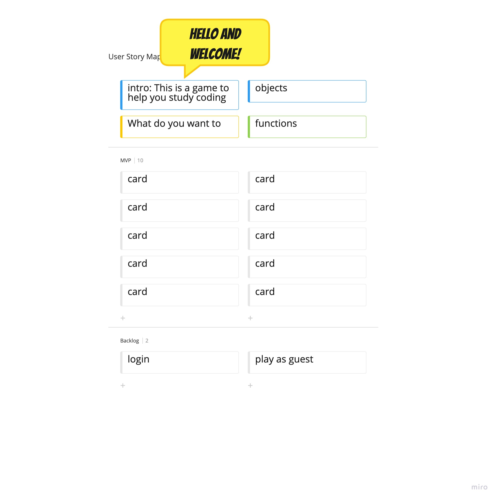

## KatherineSinkler 

Game Title: "Remember That Code!" 

## Intro:Hello There:
This is a card matching game designed to help the memory easily access the basics of html, DOM, css, and JavaScript so that we don't waste time googling the most basic things while coding a webpage.

It is important to create projects that I will personally use and I have been look for a good online study tool for a while now. There are many proven benefits found in using flash cards (see below): The main goal that should be achieve through playing this game consistently is to create memory retention to help maintain the most basic groundwork learned in fast paced education that is learned in coding bootcamps and to also sharpen the memory of those who just don't remimber concepts sometimes. The ultimate plan is to help guide our brain to transfer information from the working memory, then to the short-term memory, and  eventually to the long term memory.
Since this game is designed to be a study tool, The overall format will be designed with flash cards  and/or card matching games as a templet because these games force recall skills and are meant to be quick to play as well as uncomplicated to use.

Here are some expected benefits of playing this game:

* active recall
* Testing the strength of your brain
* testing coherent understanding of material.
* become better at concepts 
* matching terminology to specific problems.

### Wireframe

### User Experience

* I want the user to have a random collection of cards at each start of game so that the memory isn't programed to focus on how to cheat through the game, but instead how to learn through it.
* I want the user to know what score they have by implementing an accuracy score into the program.
* 1) I want the user to see all cards at once on 2-4 card cells/columns and  2) click a card from one column and then click the matching card from another cell/column to try to make a match.
* I want the user to be able to login and save progress to compare.
* I want the user to easily navigate the webpage. 
* The user should be able to choose which game they want to play based on the subject they want to practice.
* I want the user to be able to quit current subject they are playing and to start on a new subject if they please; or just to be able to quit altogether with the option to save data. 
* I want dropdown menus or buttons to offer different subject options of basic concepts that the user would like to study whenever they login.
* I want the user to access the game through logging in or as to play as a guest. 
* This is a single player game.

### Contributers
* This game will be on a public github profile so that others who want to customize it to their needs may fork, clone, and edit it for themselves as a study tool.
* I would like to also see other programmers that can add improvements to this game or suggest ways to fix bugs.

### MVP

* I want basic wireframe in place and 1 basic subject with at least two cells/columns of cards in place. 
* I want the user experience to look as similar to my wireframe as possible.
* I want to ensure that html, css, and js pages are correctly linked and deployed as a website.
* I want to make sure that all pseudocode is functional.
    Javascript prompt() method will respond to a login user or guest user accordingly. 
    Array itteration other array methods will be used to create card options.
    DOM manipulation will be used to navigate the site and to practice the funtional abilities.
    I think flexbox will work well for the css and overall wireframe design.
    HTML will include Nav Bar and Divs within the body to accomplish the wire frame goals.  
* Start viewport as a cellphone media query and next make it suitable for pc use.
* Create a sidebar that will be responsive to keeping the score and to supply a dropdown menu so that the user can quit, save game, or to manage account. 
* The game will be black and white for now.

### Version 2:

* Everything from mvp.
* 1-3 subjects added with the same structure of each game. 
* Full user experience in place.
* Media queries in order for most Iphones and Galaxy's.
* Check marks for matches and x's for mix-match 
* Add color and background design elements.
* Psuedocode should mostly be the same as MVP except more aesthetically pleasing for the sake of engagement.

### Version 3 (ambitious stretch goals): 
* 5 subject to play.
* Add different colors to different subjects.
* Sound bites upon completion.
* Added Javascript functions to allow color gradients and sound effects according to user success or downfall.
* Organize subjects to be used together to create some kind of web design by saving each match like a puzzle to a predesigned html page once all matched subjects are completed. 

### Project Timeline.
* I want MVP done by Thursday (1.4.22). 
* I want to try to have some version 2 or all in place by Friday (1.5).
* I want to only focus on practicing the games functionality, editing/fixing bugs, and/or deleting  things that are just not working by Sunday(1.6).

### Pseudocode.

* 1. Use a ifElse loop to display player progress. If player successfully matches a pair;  { print checkmark; } else { print x }.
* 2. Use an array math method to keep score of progress. Set score to 100 % and reduce score every time a card is unmatched by 5%. Nothing will change if Player gets a perfect score.
* 3. Use DOM event to create click effects for each card and button pressed.
* 4. Depending on user version, css and Javascript will add aesthetics to the DOM.
* 5. Use Javascript functions, prompt(), and Arrays to create most of the funtionality of the game. 

